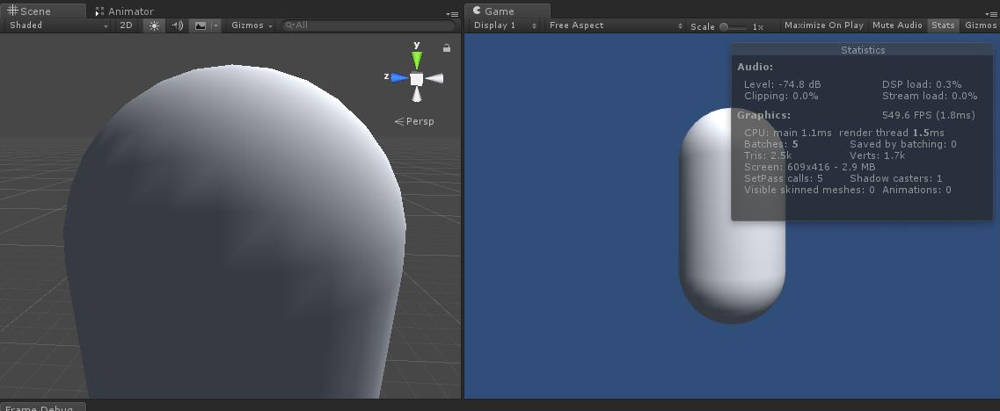
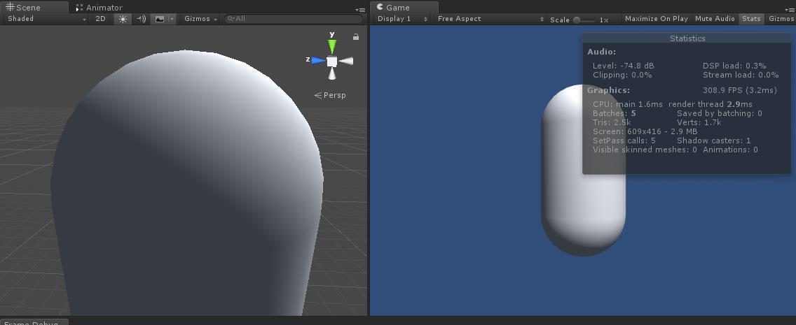
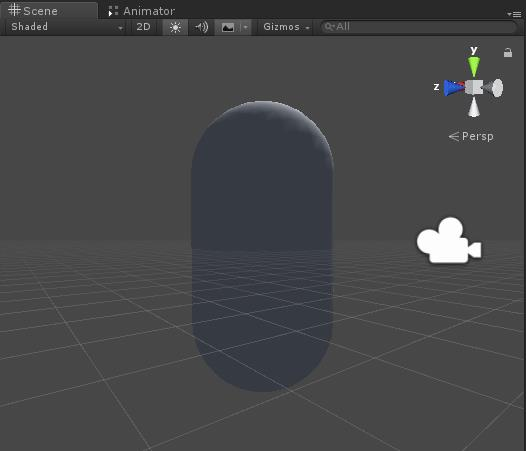
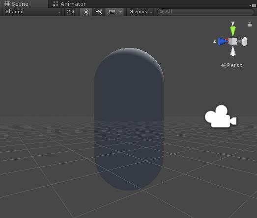
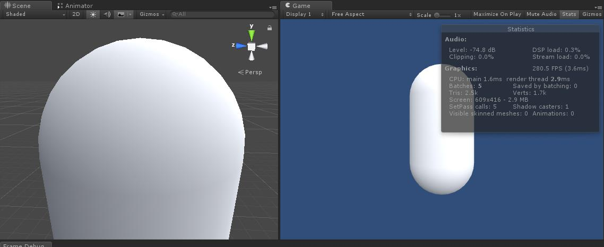
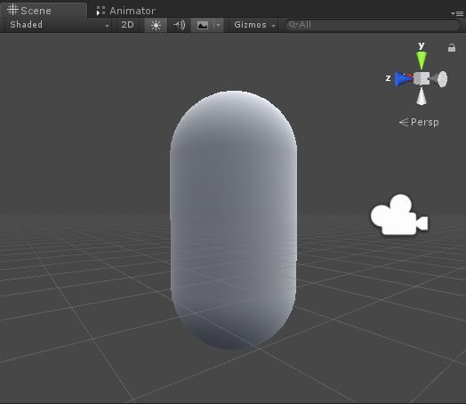

# UnityShader_Learning
---
## 漫反射光照模型（Diffuse）  
效果图： 
  
  
从两张效果图很明显可以看出，逐顶点光照其实是出现了很多锯齿的，而逐像素光照的效果更为平滑。这是因为逐顶点光照是在顶点着色器中进行光照模型的计算，
因此计算的次数和模型的顶点个数是一致的，而逐像素光照是在片元着色器中进行计算，是以每个像素为单位进行的计算。显然顶点数远远小于像素数，
所以逐顶点的计算量会更小，性能消耗更低，当然对应得到的效果就要差一些。逐像素的计算则相反。    
上述两种处理方式都符合**兰伯特定律（Lambert）** 。在计算中，为了防止模型被后面来的光源照亮，可以通过判断法线和光源方向的**点乘（dot）** 结果是否小于0得知，但这会导致背光部分没有任何明暗变化，使得背光区域像平面一样，失去了模型的细节，如图：  
    
  
为了改进上述缺点，可以采用**半兰伯特光照模型（Half Lambert）** ：  
  
  
半兰伯特的技术细节在此不作说明，但可以知道的是，半兰伯特是在原兰伯特光照模型的基础上进行的修改，是不具有任何物理依据的，其仅仅是一个trick。  
