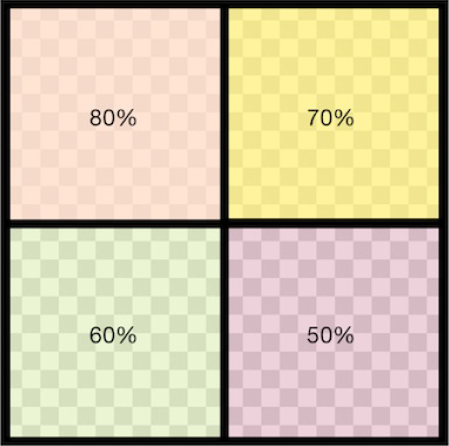
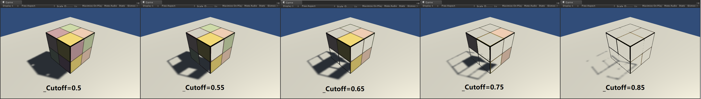

# UnityShader_Learning

> 引用资料：https://github.com/candycat1992/Unity_Shaders_Book

---

## 漫反射光照模型（Diffuse）

### 逐顶点


### 逐像素


从两张效果图很明显可以看出，逐顶点光照其实是出现了很多锯齿的，而逐像素光照的效果更为平滑。这是因为逐顶点光照是在顶点着色器中进行光照模型的计算，因此计算的次数和模型的顶点个数是一致的，而逐像素光照是在片元着色器中进行计算，是以每个像素为单位进行的计算。显然顶点数远远小于像素数，所以逐顶点的计算量会更小，性能消耗更低，当然对应得到的效果就要差一些。逐像素的计算则相反。

上述两种处理方式都符合**兰伯特定律（Lambert）**。在计算中，为了防止模型被后面来的光源照亮，可以通过判断法线和光源方向的**点乘（Dot）** 结果是否小于0得知，但这会导致背光部分没有任何明暗变化，使得背光区域像平面一样，失去了模型的细节，如图：

### 逐顶点


### 逐像素


为了改进上述缺点，可以采用**半兰伯特光照模型（Half Lambert）**：

### 半兰伯特光照模型


半兰伯特的技术细节在此不作说明，但可以知道的是，半兰伯特是在原兰伯特光照模型的基础上进行的修改，是不具有任何物理依据的，其仅仅是一个trick。

---

## 高光/镜面反射光照模型（Specular）

### 逐顶点


### 逐像素


从效果图中可以明显看出，逐顶点的方式中高光部分是不平滑的，这是因为在顶点着色器中对每个顶点计算光照时，会对各个顶点进行**线性插值**以得到像素光照，而**高光反射计算部分是非线性的**，因此会出现视觉问题。逐像素的方式则可以得到更加平滑的高光效果。

上述两种方式以**Phong光照模型**来进行高光反射的计算，下面展示一种在Phong模型的基础上简单修改的模型：

### Blinn-Phong光照模型


可以看出，Blinn-Phong光照模型的高光部分更大，更亮一些。

Blinn-Phong模型相对Phong模型来说更符合实际情况，但仍然不能真正的反应真实世界中的情况。Blinn-Phong模型的技术细节在此不做解释。

## 凹凸贴图（Bump mapping）中的法线贴图（Normal mapping）

最近初学纹理相关部分的知识，有许多概念理解不是很透彻，查找多方资料后自己对一些概念有了一定的初步理解，在此记录下来，方便日后回顾与更正。

### 基本概念————空间变换

> 如果要求A空间到B空间的变换矩阵，只需知道A空间的三个坐标轴在B空间下的表示、按X、Y、Z轴的顺序**按列排序**构建一个矩阵即可得到。

### 法线贴图中存的是什么，如何存储且如何使用

> 顾名思义，既然是贴图，那存的就是含有RGBA通道的图，但这不是一般的图像，一般来说，这个图像的RGB分量存的是对应模型法线的xyz坐标。当然法线是不能直接存储在贴图中的，所以这里就需要一个映射：
>> 
>
> 因此换句话说，法线贴图中存的就是把法线经过映射后得到的像素值，一般也说是 **纹素（texel）** 值，即纹理贴图的基本单元。
>
> 前面提到，一般情况下，法线贴图的RGB分量对应的是法线的xyz坐标，但在Unity中，Unity会对法线贴图的存储进行优化，同时根据平台的不同选择不同的优化方式。
>
> 当我们对法线贴图进行采样后，此时我们采样得到的结果是已经被Unity优化过后的结果，这个时候就需要我们对结果进行**UnpackNormal**操作以获得真正的纹素值，具体的UnpackNormal函数内部实现如下：
>
```cpp
inline fixed3 UnpackNormalDXT5nm (fixed4 packednormal)
{
    fixed3 normal;
    normal.xy = packednormal.wy * 2 - 1;
    normal.z = sqrt(1 - saturate(dot(normal.xy, normal.xy)));
    return normal;
}
// Unpack normal as DXT5nm (1, y, 1, x) or BC5 (x, y, 0, 1)
// Note neutral texture like "bump" is (0, 0, 1, 1) to work with both plain RGB normal and DXT5nm/BC5
fixed3 UnpackNormalmapRGorAG(fixed4 packednormal)
{
    // This do the trick
   packednormal.x *= packednormal.w;

    fixed3 normal;
    normal.xy = packednormal.xy * 2 - 1;
    normal.z = sqrt(1 - saturate(dot(normal.xy, normal.xy)));
    return normal;
}
inline fixed3 UnpackNormal(fixed4 packednormal)
{
#if defined(UNITY_NO_DXT5nm)
    return packednormal.xyz * 2 - 1;
#else
    return UnpackNormalmapRGorAG(packednormal);
#endif
}
```
> 可以看出Unity对法线贴图优化后，贴图的各纹素RGB分量就不对应法线的xyz坐标了，因此我们就需要解码。以编码格式DXT5nm为例，纹素的的A通道（即w分量）对应法线的x坐标，G通道（即y分量）对应法线的y坐标，而R和B通道则被舍弃，然后对结果进行一次反映射就能得到原先法线的xy坐标。
>
> 由于法线是单位向量，我们便可以通过法线的xy坐标值计算出z坐标值，因此我们可以仅存储xy坐标从而推导得到z坐标，这就进一步缩小了法线贴图所占空间。
>
> 而对于不同的编码方式，如何用统一的方式对其进行解码，这里有一个比较技巧性的方法：
>> `packednormal.x *= packednormal.w;`
>
> 由于DXT5nm和BC5两种编码格式的R通道和A通道乘积均为x，也就是对应法线的x坐标值，同时两者的G通道皆对应法线的y坐标值，因此可以利用这个特点进行统一解码。
>
> 当然，**上述情况的前提是把纹理贴图的Texture Type选择为Normal map**，如果没有使用这个设置，就需要手动在代码中进行反映射过程，反之则需要如上所述调用UnpackNormal内置函数进行处理。

---

## 渐变纹理（Ramp Texture）

渐变纹理一般用于控制漫反射光照的效果，下面是核心代码：

```cpp
fixed halfLambert = 0.5 * dot(worldNormal, worldLightDir) + 0.5;
fixed3 diffuse = _LightColor0.rgb * tex2D(_RampTex, fixed2(halfLambert, halfLambert)).rgb * _Color.rgb;
```

第一行使用 **HalfLambert光照模型** 计算出漫反射系数，其区间在[0,1]范围内。

第二行是漫反射结果的计算公式，其中材质的漫反射颜色是使用对渐变纹理进行采样的方式得到的：

```cpp
tex2D(_RampTex, fixed2(halfLambert, halfLambert);
```

关键就在这里，**使用第一行计算出来的漫反射系数作为渐变纹理的纹理坐标进行采样。** 原理如下：

> 模型顶点的法线与光源方向夹角越大，该顶点受到的光照也越弱，计算出halfLambert的值就越小，也就越接近0，对应渐变纹理的坐标就越靠近左下角。反之，模型顶点的法线与光源方向夹角越小，该顶点受到的光照也越强，计算出halfLambert的值就越大，也就越接近1，对应渐变纹理的坐标就越靠近右上角。而渐变纹理从左到右一般是由深到浅的，因此可以使用渐变纹理来模拟漫反射光照的强弱（色调）变化。

---

## 透明效果

### 透明度测试（Alpha Test）

> **透明度测试** 用于判断一个片元的透明度是否满足条件（通常判断是否小于某个阈值）。若小于该阈值，则直接舍弃该片元，之后不再对该片元进行任何处理，否则就按不透明物体的处理方式进行处理（即深度测试，深度写入等）。

具体代码：

```cpp
// Alpha Test
clip(texColor.a - _Cutoff);
// Equal to
// if((texColor.a - _Cutoff) < 0.0)
// {
// 	discard;
// }
```
上述代码中，`texColor.a`是对纹理贴图采样得到的纹素透明度，`_Cutoff`即为用于测试的阈值，`discard`是用于剔除片元的指令。

#### 测试用例图（一张分布不同透明度的纹理贴图）



#### 效果图



从效果图中可以看出

> * 透明度测试产生的效果比较极端，要么完全透明（即看不到），要么完全不透明。
> * 完全的透明效果并不“完全”，在边缘处往往参差不齐，存在锯齿，这是由于在边缘处纹理透明度的变化精度问题导致的。

因此一般采用 **透明度混合** 的方式生成透明效果。

### 透明度混合（Alpha Blend）

> **透明度混合** 可以的到真正的半透明效果。其使用当前片元的透明度作为混合因子，与已经存储在颜色缓冲中的颜色值进行混合，得到新的颜色。

上述可表示为如下公式：

> 

其中，`SrcAlpha`为当前片元的透明度，`SrcColor`为当前片元的颜色值，`DstColor`为存储在颜色缓冲区中的颜色值。

注意在Unity中，ShaderLab里表示该公式的Blend语义 **通常（也有其他混合语义）** 为：`Blend SrcFactor DstFactor`。其中，`SrcFactor`为当前片元的混合因子，`DstColor`为颜色缓冲区中的混合因子。该命令默认开启了混合模式，但只有开启了混合，设置片元的透明度才有意义。

#### 效果图


**注意：** 透明度混合需要关闭 **深度写入（ZWrite）** ， 关闭深度写入的原因与模型的渲染顺序有关，在此不作说明。

### 开启深度写入的半透明效果

> 方法：使用两个Pass。第一个Pass开启深度写入，保证像素级片元的深度值正确；第二个Pass进行正常的渲染。
